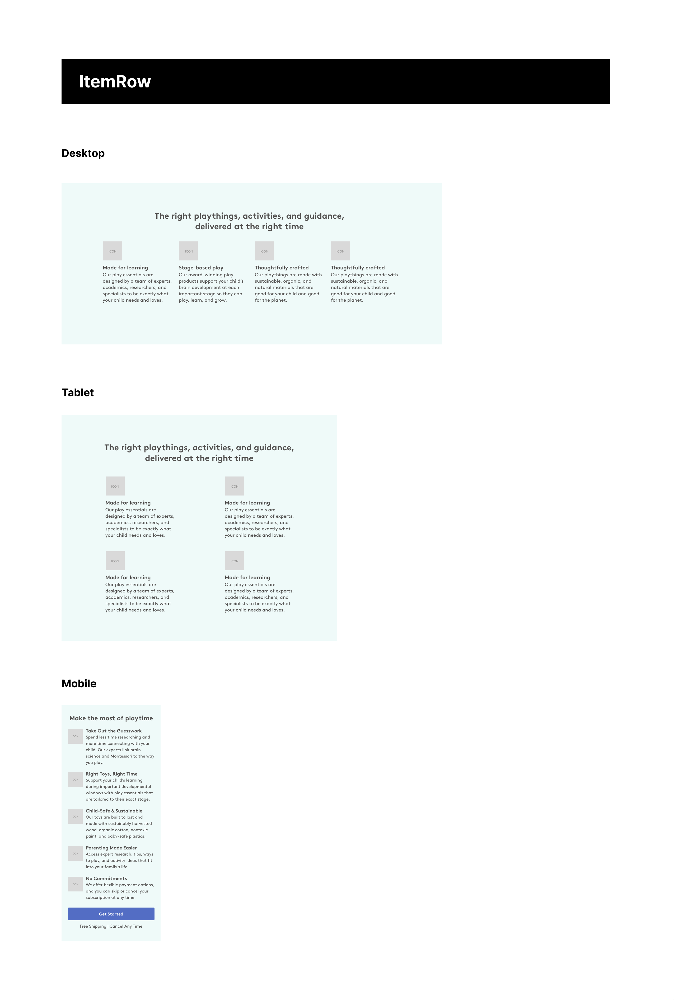

This repository contains the Lovevery Frontend take-home challenge. This activity is open-ended without a right or wrong answer; it's only meant to gauge your approach to frontend problem solving. Relax, take your time, and have fun.

## Setup

This repository contains a Next.js application generated via `create-next-app`.

```bash
$   npm install      # install dependencies
$   npm run dev      # run locally
```

Open [http://localhost:3000](http://localhost:3000) with your browser to see the result.

## Prompt

The goal of this exercise is to build a reusable React component and to place it on a test page. The mockup details two different components to choose from: the MediaBanner and the ItemRow. The mockup provides a general layout, a color palette, and expected behavior on various screen sizes. Your task is to build one of these components in a reusable manner, to leverage the hook at `src/useData`, and to render the component on the page at `src/page`. Please use both TypeScript and Tailwind CSS to build your solution.

## Solution
Component chosen: ItemRow

### Overview
The ItemRow component is found in `/components/item-row`. It is build of multiple sub-components, which are built with using core components.

Core components are intended to return basic HTML elements, and accept classnames and children. This allows us to pollute the core components with classnames, while keeping the component usage clean-er, since Tailwind can get out of hand quickly. The downside to this approach is how Tailwind's class hierarchy works, but if building on top of this, we can use tools like TailwindMerge to remove the friction and keep us from having to !important certain styles.

All sub-components that make up the ItemRow are located within the `item-row` directory, while the index file contains the exported top level component. I might have gone too far with splitting the components, but I find it easier to parse/understand larger components if they are appropriately named and only contain what they need for what they are used for. I left them in the same directory to avoid confusion of having multiple similarly named components floating around, since they are specific to this use.

The top level ItemRow component is a client side component that gets data from the useData hook. There are very simple loading and error components/states. The loading state is triggered automatically while loading the page, but the error state needs to be triggered by returning `error: true` from useData - other error handling includes a fallback image src for the core Image component. This functionality would likely be replaceable given an error would be a different type and we could utilize NextJS's loading and error functionality instead.

### Codebase structure

I chose to separate out general concerns into their own directories, which can be built upon as additional files are added. As code bases grow, I find using the concern's namespace extremely useful in pointing us straight to where we need to be, rather than having to know or search. Below is a breakdown of the general methodology and comments about future development.

**/app**

There is not much here at the moment, but only additional pages/layouts/routes would live here, as required by NextJS.

**/components**

All UI components within are separated by use. Much like atomic design, there are components that are intended to be core building blocks for all larger components. For this work, I have split the components into 'core' and 'item-row' directories. Core contains base level components, as explained above, and would be used as you would a plain HTML element. These core components are then used in building larger components. Since this example is a use specific component, I created an item-row directory that holds all of the components that make up the ItemRow component. Admittedly, I might have gone overboard with separating the components here, but the over all idea is to have all of the feature specific components located in the same directory and have the index file hold the exportable component.

Tests also live here, along side their coupled components.

**/hooks**

Currently, there is only the given, useData hook, but this would be separated into use-specific directories to hold relevant hooks.

**/interfaces**

At the moment, this only contains one file, but as the need for additional types/interfaces grows, they would be grouped together by use case. example: /shared, /[component-or-usecase].

**/styles**

This directory is mainly here to hold the global.css file that is needed for tailwind to work. There would likely be a few use cases for adding styles here, but would need to be done thoughtfully to avoid the need to search for additional css.

### Styling
I utilized Tailwind's config to attempt a small design system to handle things like fonts, colors, and text sizes. This work did not require much there, as a lot of the spacing was consistent with Tailwind's defaults. Further structured work could benefit this design system.

### Testing strategy
Given there was not a great deal of additional functionality involved in this work, I focused on testing each component for basic UI elements and correct usage of props. This includes each core element as well as the top level item-row component.

I think the addition of snapshots would be great here - to help us be aware when we change components, which can help catch unwanted side effects. On top of that, adding tests to handle component error cases and image fallbacks, would be a good addition.

Of course, if this component had more functionality, setting up automated user flow testing, like Cypress, would also be ideal.

### What I would have done differently
If I were to re-do this assignment, I would want to take a look at the layout of the items. I used flex for the layout, but am wondering if grid would have done a better job. I chose flex because of the way it can handle an un-even number of items and keep the layout from being lopsided without getting too complicated. I'm not sure if the component is intended to have a set amount of items - the mockup wasn't entirely clear, but it would likely make sense to update it if does. Other than that, I think the end work matches the designs well - its hard to say while working from an image and without the correct font, but there would likely be room for improvement if that was rectified.

## Mockup

<details>
  <summary>ItemRow</summary>



</details>

## Scoring

This activity is intentionally open-ended and aims to gauge your general approach to React development. The following themes will be considered during review:

1. **Technical Expertise**: Showcasing proficiency in React and TypeScript, emphasizing effective code organization and type-safe practices.
1. **Code Quality**: Demonstrating clean, adaptable coding with a robust approach to testing, ensuring efficiency and readability for various data structures.
1. **Problem Solving**: Exhibiting innovative, responsive solutions that effectively function across different devices and screen sizes.
1. **Product Awareness**: Understanding the impact of development decisions on the end-user experience and the overall product.

## Submission

Once you're done, please email us with an archive of your repository. Kindly write a README detailing a description of your solution. This will help us understand your technical approach, design decisions and your ability to effectively communicate and document your work.
